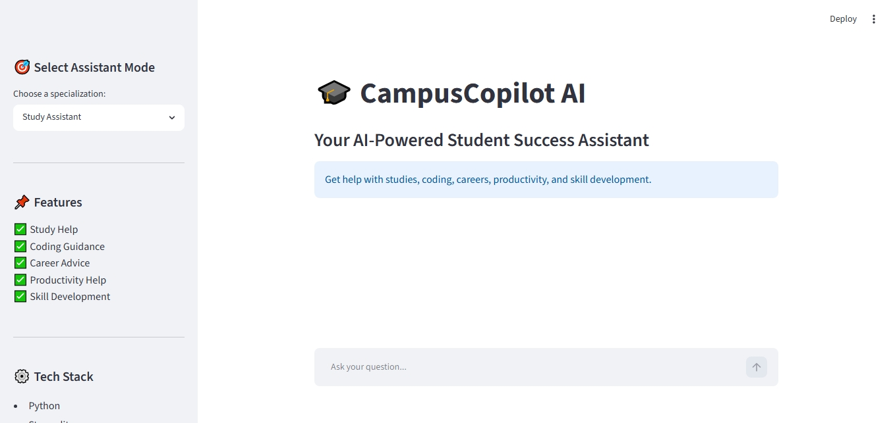
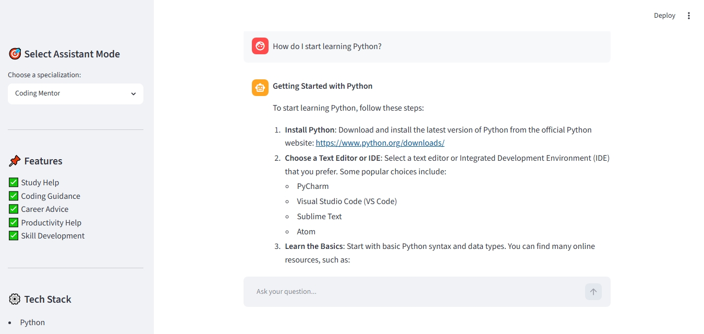
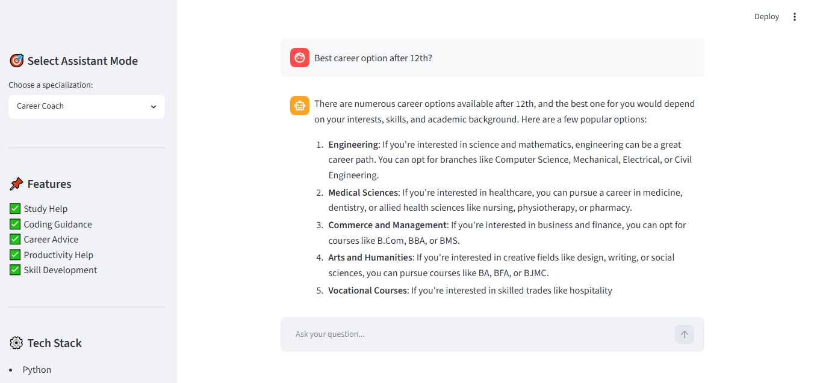

# 🎓 CampusCopilot AI

**CampusCopilot AI** is a multi-specialization AI assistant designed to help students with academics, coding, career guidance, and productivity.

CampusCopilot AI is designed to help students get focused guidance in different areas such as academics, coding, career planning, and productivity.

---

## 🚀 Features

### 📚 Study Assistant

Helps students with:

* Study plans
* Exam preparation
* Academic guidance
* Subject explanations
* Learning strategies

### 💻 Coding Mentor

Helps with:

* Python programming
* Coding roadmaps
* Debugging
* Software development basics
* Web development guidance

### 🎯 Career Coach

Provides guidance for:

* Career options after 10th/12th
* Engineering branches
* Skills development
* Internships
* College decisions

### ⚡ Productivity Mentor

Helps improve:

* Focus
* Discipline
* Time management
* Habit building
* Productivity systems

---

## 🛠️ Tech Stack

* Python
* Streamlit
* Groq API
* Llama 3
* VS Code

---

## 📷 Project Screenshots

### Home Interface



### Coding Mentor Mode



### Career Coach Mode



---

## 💡 Problem Statement

Students often struggle to find focused guidance for different areas such as academics, coding, careers, and productivity.

Students often need different types of help, but most chatbots give the same general responses for everything.

**CampusCopilot AI solves this problem by offering specialized AI mentor modes**, allowing students to receive more relevant and focused assistance based on their needs.

---

## ▶️ How to Run the Project

### 1. Install dependencies

```bash
pip install -r requirements.txt
```

### 2. Add API Key

Create a `key.env` file and add:

```env
GROQ_API_KEY=your_api_key_here
```

### 3. Run the project

```bash
streamlit run app.py
```

---

## 🌟 Key Highlights

✅ Multi-specialization AI assistant
✅ Fast responses using Groq API
✅ Clean Streamlit user interface
✅ Focused mentor-based guidance
✅ Student productivity + learning support

---

## 👨‍💻 Developed By

**Mohammad Ali**
